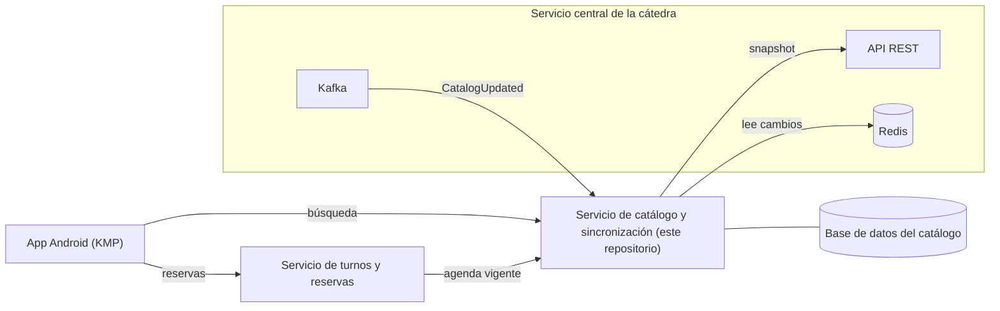
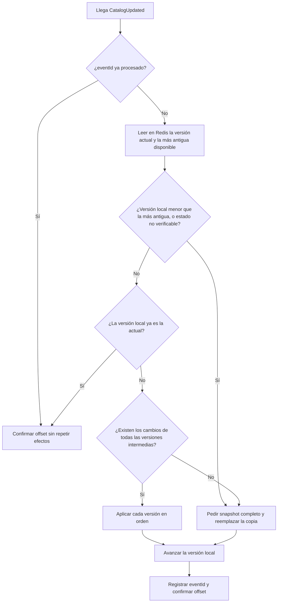

# Servicio de catálogo y sincronización

Backend en Java y Spring Boot que mantiene una copia local del catálogo de profesionales de la salud publicado por la cátedra, la mantiene al día y resuelve búsquedas sobre ella. Forma parte del proyecto integrador 2026: un sistema distribuido de turnos con datos ficticios, sin relación con ningún sistema médico real.

> **Estado:** el repositorio está en etapa de arranque. Este documento fija el contexto, las decisiones y el plan. Las secciones marcadas como *previsto* o *pendiente* se completan a medida que se implementan. Los comandos de ejecución se confirman al cerrar el Sprint 1.

## Contenido

1. [Contexto del proyecto](#1-contexto-del-proyecto)
2. [Qué hace este servicio](#2-qué-hace-este-servicio)
3. [Integración con la cátedra](#3-integración-con-la-cátedra)
4. [Cómo se sincroniza el catálogo](#4-cómo-se-sincroniza-el-catálogo)
5. [Arquitectura](#5-arquitectura)
6. [Modelo de datos](#6-modelo-de-datos)
7. [Seguridad](#7-seguridad)
8. [Decisiones técnicas](#8-decisiones-técnicas)
9. [Requisitos y configuración](#9-requisitos-y-configuración)
10. [Ejecución y pruebas](#10-ejecución-y-pruebas)
11. [Evidencias a demostrar](#11-evidencias-a-demostrar)
12. [Plan de trabajo y flujo de Git](#12-plan-de-trabajo-y-flujo-de-git)
13. [Glosario](#13-glosario)
14. [Documentación relacionada](#14-documentación-relacionada)

---

## 1. Contexto del proyecto

La cátedra administra un servicio central que es la fuente de verdad del catálogo de categorías, profesionales y horarios semanales, y de las reservas de turnos. Cada alumno construye, de forma individual, una solución que se conecta a ese servicio:

| Pieza | Tecnología | Responsabilidad |
| --- | --- | --- |
| App Android | Kotlin Multiplatform | Registro e inicio de sesión de usuarios, búsqueda de profesionales y reserva de turnos |
| **Servicio de catálogo y sincronización** | Java, Spring Boot | **Este repositorio.** Copia local del catálogo, sincronización y búsqueda |
| Servicio de turnos y reservas | Java, Spring Boot | Disponibilidad, bloqueos temporales (holds), flujo de reserva y cancelación |
| Documentación | Markdown | Enunciado, contrato de la cátedra, decisiones (ADR), diagramas y minutas |

Los dos backends son independientes: cada uno es dueño exclusivo de sus datos y de sus migraciones, y se comunican solo mediante contratos explícitos protegidos con JWT. No comparten base de datos como mecanismo de integración ni acceden a las estructuras internas del otro.



## 2. Qué hace este servicio

**Responsabilidades**

- Guardar la única copia local vigente de categorías, profesionales y horarios semanales.
- Conservar la versión del catálogo aplicada y el estado de la sincronización.
- Sincronizar de dos maneras: completa (snapshot por REST) e incremental (Kafka avisa, Redis entrega los cambios).
- Detectar cuándo no es seguro seguir de forma incremental y reconstruir la copia.
- Buscar y filtrar profesionales usando solo datos locales. Filtros mínimos: categoría, nombre, estado habilitado y disponibilidad.
- Entregar al servicio de turnos el profesional y su agenda semanal vigente mediante un contrato propio.
- Informar el estado y los errores de la sincronización.

**Fuera de alcance de este servicio**

- Ocupaciones, bloqueos temporales y reservas: pertenecen al servicio de turnos.
- Construir la disponibilidad real de un turno, que necesita las ocupaciones de la cátedra.
- Consultar a la cátedra en cada búsqueda: las búsquedas nunca salen del servicio.

## 3. Integración con la cátedra

El servicio usa la cuenta técnica del proyecto, que es una identidad distinta de la de los usuarios finales. Todos los datos de acceso (direcciones, credenciales, topics y token) se reciben por otro canal y se cargan por variables de entorno: no se guardan en el repositorio.

| Canal | Qué se usa | Para qué |
| --- | --- | --- |
| REST | `GET /api/synchronization/snapshot` | Sincronización completa |
| Redis | Claves `catedra:sync:*` (solo lectura) | Versiones, metadata y cambios incrementales |
| Kafka | Evento `CatalogUpdated` | Aviso de que existe una versión nueva |

**Redis (solo lectura)**

| Clave | Contenido |
| --- | --- |
| `catedra:sync:current-version` | Última versión publicada |
| `catedra:sync:oldest-available-version` | Versión más antigua con historial disponible |
| `catedra:sync:metadata` | Hash con versión actual, más antigua y fecha de publicación |
| `catedra:sync:professional-categories` | Hash por ID con el JSON de cada categoría |
| `catedra:sync:professionals` | Hash por ID con el JSON de cada profesional |
| `catedra:sync:weekly-schedules` | Hash por ID con el JSON de cada horario semanal |
| `catedra:sync:changes:{version}` | JSON con los IDs afectados en esa versión (no las entidades completas) |

Las entidades deshabilitadas permanecen en los Hashes: representan bajas lógicas y se conservan también en la copia local.

**Kafka**

- La entrega es *al menos una vez*: pueden llegar mensajes duplicados.
- `eventId` es la clave de idempotencia.
- `CatalogUpdated` solo notifica: los datos se obtienen de Redis o del snapshot.
- Los consumidores deben ignorar los campos desconocidos compatibles con la versión 1.

**Dos identidades que nunca se mezclan**

| Identidad | Quién la usa | Dónde vive |
| --- | --- | --- |
| JWT técnico de la cátedra | Los dos backends, contra el servicio central | Variables de entorno; nunca llega a la app |
| JWT de usuario final | La app, contra los backends propios | Lo emite el backend propio |

## 4. Cómo se sincroniza el catálogo

**Sincronización completa.** Se pide el snapshot cuando la base local está vacía, cuando hay que reconstruirla o cuando no se puede continuar de forma segura. Las tres colecciones y la versión se guardan juntas, en una sola unidad de trabajo, y la versión local es exactamente el `snapshotVersion` recibido.

**Sincronización incremental.** Llega `CatalogUpdated` por Kafka. Con esa versión nueva se consulta Redis y se aplican los cambios posteriores a la versión local, en orden. La versión local solo avanza cuando la unidad de trabajo de esa versión terminó bien.

**Recuperación.** Si falta una versión, si la versión local es menor que `oldest-available-version` o si el estado no se puede verificar, se hace una sincronización completa. Ejemplo del contrato: con versión local 3 y `oldest-available-version` 4, no se intenta aplicar `changes:4`, porque falta la versión que conecta el estado local.

Flujo previsto:



**Reglas que no se negocian**

- Los datos y la versión local cambian juntos o no cambian.
- El offset de Kafka se confirma después de persistir.
- Procesar dos veces el mismo evento o el mismo cambio no altera el resultado.
- Si una reconstrucción falla, se conserva la última copia consistente y se informa el error.
- Mientras se reconstruye, las búsquedas pueden usar la última copia consistente, con aviso de posible desactualización.

## 5. Arquitectura

Arquitectura hexagonal (puertos y adaptadores) con los principios SOLID. La lógica de negocio queda en el centro, sin conocer Spring, JPA, Kafka ni Redis; todo lo externo entra y sale por puertos, y los adaptadores los implementan. En lugar de modelos anémicos se implementan casos de uso.

| Capa | Contiene | Depende de |
| --- | --- | --- |
| `domain` | Entidades de dominio y puertos (interfaces) | Nada del framework |
| `application` | Implementación de cada caso de uso y excepciones | `domain` |
| `infrastructure` | Controllers REST, listeners de Kafka, cliente Redis, cliente REST de la cátedra, persistencia JPA | `application` y `domain` |

Organización de paquetes prevista, siguiendo el ejemplo de arquitectura hexagonal de la materia y organizada por funcionalidad:

```
<funcionalidad>/
├── domain/
│   ├── model/                 entidades de dominio
│   └── ports/
│       ├── in/                un caso de uso por interfaz
│       └── out/               lo que el dominio necesita (repositorios, clientes)
├── application/
│   ├── usecases/              implementación de los casos de uso
│   └── exception/
└── infrastructure/
    ├── persistence/           adapter, entity, mapper, repository
    ├── web/                   controller, dto, mapper
    └── messaging/             listener de Kafka, cliente Redis, cliente REST de la cátedra
```

Funcionalidades previstas (a confirmar al planificar cada una): `synchronization` (snapshot, incremental, recuperación y estado) y `catalog` (búsqueda y consulta para turnos).

Criterios de diseño:

- Un caso de uso hace una sola cosa; los puertos son chicos y específicos.
- Dominio, entidades JPA y DTO son clases distintas, conectadas con mappers.
- Los controllers y los listeners solo traducen y delegan al caso de uso.
- Se prefiere código simple y métodos chicos y testeables, sin abstracciones que todavía no hacen falta.

## 6. Modelo de datos

Propuesta inicial; el esquema definitivo queda en las migraciones de Flyway. Los identificadores de categorías, profesionales y horarios son los que asigna la cátedra, no se generan localmente. Este servicio es el único dueño de estas tablas.

| Tabla | Campos principales |
| --- | --- |
| `professional_category` | `id`, `name`, `description`, `enabled`, `created_at`, `updated_at` |
| `professional` | `id`, `category_id`, `first_name`, `last_name`, `enabled`, `created_at`, `updated_at` |
| `weekly_schedule` | `id`, `professional_id`, `day_of_week`, `start_time`, `end_time`, `slot_duration_minutes`, `enabled`, `created_at`, `updated_at` |
| `sync_state` | versión aplicada, estado (sincronizado, reconstruyendo o con error), fecha del último éxito, último error sin datos sensibles |
| `processed_event` | `event_id`, fecha de procesamiento (para deduplicar) |

Notas del contrato: `day_of_week` toma `MONDAY` a `SUNDAY`; los horarios se reciben como `HH:mm` o `HH:mm:ss`; los instantes están en UTC en formato ISO-8601.

## 7. Seguridad

- Ninguna API protegida se puede usar sin autenticación; se valida firma, vigencia y permisos del JWT.
- El JWT técnico de la cátedra no se acepta como credencial de usuario ni se envía a la app.
- Credenciales, tokens y direcciones se externalizan; `.env` no se versiona y no se escriben secretos en logs ni en respuestas.
- Se validan los datos de entrada en cada endpoint y se configura CORS solo para los clientes permitidos.
- Los errores no exponen trazas ni detalles internos.

Pendiente: definir qué servicio emite el JWT de los usuarios y cómo se propaga la identidad entre turnos y catálogo. Se registra en un ADR.

## 8. Decisiones técnicas

| Tema | Decisión | Estado |
| --- | --- | --- |
| Lenguaje | Java 21 | Decidido |
| Framework | Spring Boot, línea 4.1.x (la del ejemplo de la materia) | Confirmar versión exacta |
| Build | Maven con wrapper | Decidido |
| Base de datos | PostgreSQL | Decidido |
| Migraciones | Flyway; el esquema lo maneja solo Flyway y Hibernate únicamente valida | Decidido |
| Infraestructura local | Docker Compose | Decidido |
| Pruebas | JUnit, Spring Boot Test y Testcontainers | Decidido |
| Paquete base | Por definir | Pendiente |
| Estrategia de reemplazo del snapshot | Por definir | Pendiente |
| Significado del filtro de disponibilidad | A consultar con el profesor | Pendiente |
| Contrato con el servicio de turnos | A acordar entre los dos servicios | Pendiente |
| Emisión y propagación del JWT de usuarios | Por definir | Pendiente |

Cada decisión se documenta con su motivo en un ADR del repositorio de documentación.

## 9. Requisitos y configuración

**Requisitos**

- JDK 21.
- Docker y Docker Compose (base de datos local y pruebas con Testcontainers).
- No hace falta instalar Maven: el proyecto incluye el wrapper `mvnw`.
- Acceso de red al servicio de la cátedra, necesario para sincronizar. Los datos de acceso se reciben por otro canal y no se publican en este repositorio.
- Una cuenta técnica de integración, creada una única vez con Postman contra el servicio de la cátedra (`POST /api/student/register`). El JWT y la configuración que devuelve se guardan de forma segura.

**Variables de entorno** (nombres propuestos; se confirman al implementar la configuración)

| Variable | Uso |
| --- | --- |
| `SPRING_DATASOURCE_URL`, `SPRING_DATASOURCE_USERNAME`, `SPRING_DATASOURCE_PASSWORD` | Conexión a la base del catálogo |
| `CATEDRA_API_BASE_URL` | Dirección base de la API REST de la cátedra |
| `CATEDRA_JWT` | JWT técnico de la cuenta de integración |
| `CATEDRA_GROUP_ID` | Identificador de la integración |
| `CATEDRA_REDIS_HOST`, `CATEDRA_REDIS_PORT`, `CATEDRA_REDIS_USERNAME`, `CATEDRA_REDIS_PASSWORD` | Acceso a Redis |
| `CATEDRA_KAFKA_BOOTSTRAP_SERVERS`, `CATEDRA_KAFKA_CONSUMER_GROUP`, `CATEDRA_KAFKA_CATALOG_TOPIC` | Acceso a Kafka |

Se versiona un `.env.example` con los nombres y sin valores reales. El archivo `.env` está en `.gitignore`.

## 10. Ejecución y pruebas

*Previsto; se confirma al terminar el Sprint 1.*

```bash
# Base de datos local
docker compose up -d

# Compilar y ejecutar las pruebas
./mvnw verify
```

Estrategia de pruebas:

- **Casos de uso:** pruebas unitarias con implementaciones falsas de los puertos, sin levantar Spring ni infraestructura.
- **Persistencia y migraciones:** pruebas de integración con un PostgreSQL temporal (Testcontainers).
- **Integración con Redis y Kafka:** pruebas con instancias temporales o simuladas.
- **Seguridad:** pruebas de acceso permitido y denegado.

## 11. Evidencias a demostrar

Las que corresponden a este servicio, según el enunciado:

| Evidencia | Cómo se demuestra | Sprint |
| --- | --- | --- |
| Inicialización desde snapshot | Prueba y ejecución con la base vacía | 2 |
| Actualización incremental | Prueba con un evento nuevo y cambios en Redis | 3 |
| Recuperación tras una discontinuidad | Prueba con versión local menor que la más antigua disponible | 3 |
| Búsquedas sobre datos locales | Pruebas por filtro, sin llamadas a la cátedra | 4 |
| Filtros por categoría, nombre, habilitado y disponibilidad | Pruebas por filtro y combinadas | 4 |
| Mensaje duplicado procesado una sola vez | Prueba con el mismo `eventId` dos veces | 3 |
| Separación de datos entre servicios | Bases y migraciones propias; sin acceso cruzado | 1 |
| Rechazo de accesos no autenticados o no autorizados | Pruebas de seguridad | 5 |

## 12. Plan de trabajo y flujo de Git

**Sprints** (quincenales, con reunión de seguimiento; las fechas se acuerdan con el profesor)

| Sprint | Objetivo |
| --- | --- |
| 1. Base del proyecto | Proyecto ejecutable con base de datos y pruebas; casos de uso y primer ADR |
| 2. Conexión con la cátedra y snapshot | Configuración externalizada y carga inicial del catálogo |
| 3. Actualización incremental | Kafka y Redis, idempotencia y recuperación por snapshot |
| 4. Consulta del catálogo | Búsqueda y filtros, agenda para turnos y estado de la sincronización |
| 5. Seguridad | JWT, separación de identidades, CORS y validación de entradas |

**Ramas**

- `main`: rama estable y protegida. Los PR a `main` los autoriza el profesor.
- `testing`: integración y validación antes de pasar a `main`.
- `dev`: trabajo diario.
- Ramas de trabajo por issue (`feat/<n>-descripcion`, `fix/<n>-...`, `docs/<n>-...`), creadas desde `dev` y devueltas a `dev` por PR.

Recorrido: rama de trabajo → `dev` → `testing` → `main`.

**Convenciones**

- Commits con Conventional Commits y referencia al issue, por ejemplo `feat(sync): aplicar snapshot completo y persistir versión (#12)`.
- Etiquetas por tipo (`enhancement`, `documentation`, `bug`, `refactor`, `test`, `chore`) y por área (`catalogo`, `sync`, `redis`, `kafka`, `seguridad`). También `blocked` y `needs-review`.

## 13. Glosario

| Término | Significado |
| --- | --- |
| Snapshot | Copia completa del catálogo con su versión, sin historial incremental |
| Versión del catálogo | Número que identifica el estado publicado por la cátedra |
| Discontinuidad | Falta alguna versión intermedia o la versión local quedó fuera del historial disponible |
| Baja lógica | Entidad deshabilitada que se conserva en lugar de borrarse |
| Idempotencia | Procesar dos veces lo mismo deja el mismo resultado que procesarlo una vez |
| Puerto | Interfaz que define lo que el dominio ofrece (entrada) o necesita (salida) |
| Adaptador | Implementación concreta de un puerto (REST, JPA, Kafka, Redis) |
| Caso de uso | Una operación del negocio, con su interfaz de entrada y su implementación |
| `groupId` | Nombre del campo que identifica la integración técnica del proyecto ante la cátedra |

## 14. Documentación relacionada

- Enunciado del proyecto integrador 2026 y referencia de integración con la cátedra.
- Decisiones de arquitectura (ADR), diagramas y minutas: repositorio de documentación.
- Servicio de turnos y reservas.
- App Android KMP.

**Autoría:** *Guadalupe Yañez - 2026*.